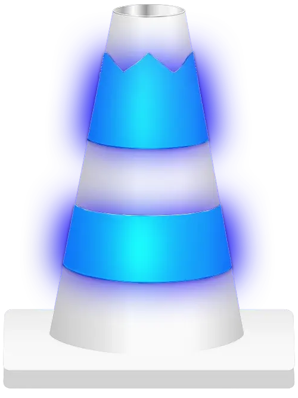
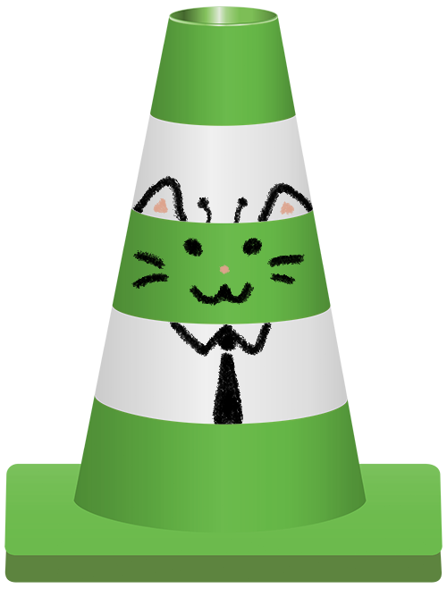
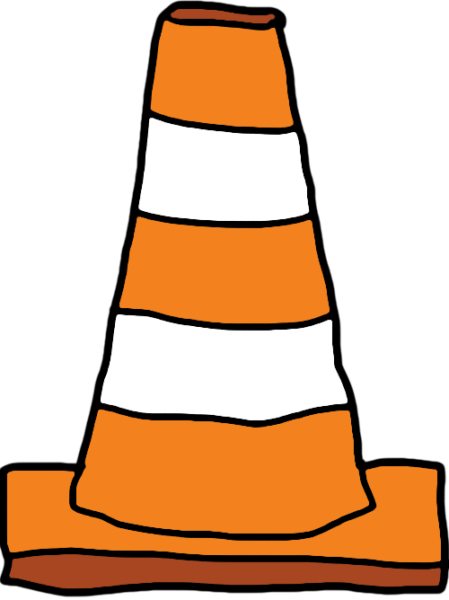
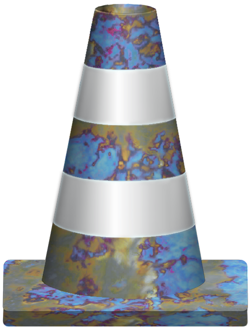
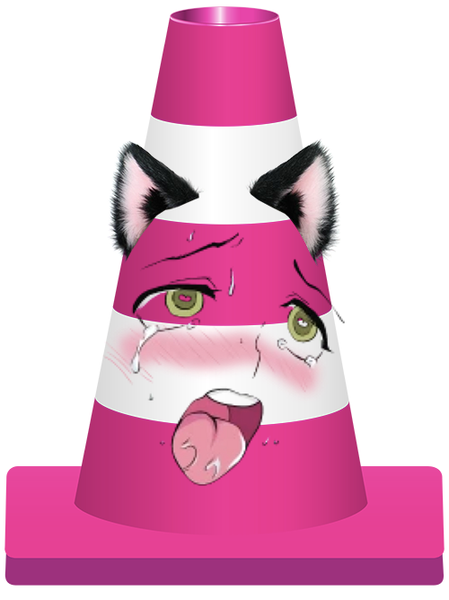
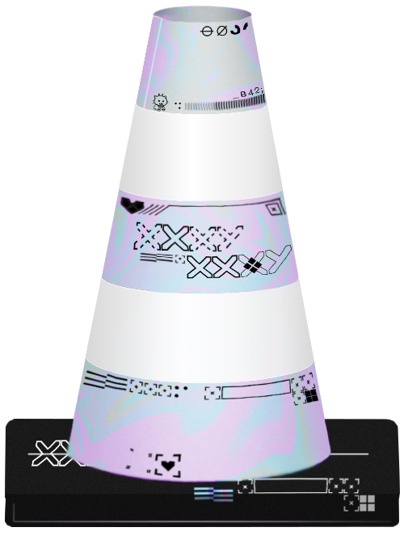
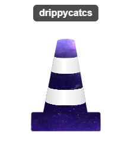
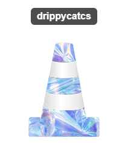
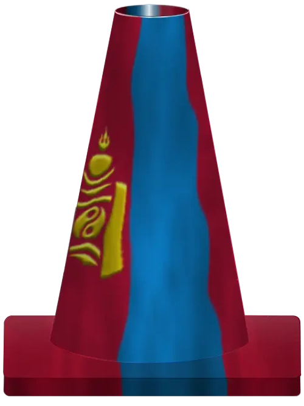

# 📜 Twitch Bot Commands

## 🛠 Available Commands

| **Command**            | **Description**                                             | **Usage**                               |
|------------------------|-------------------------------------------------------------|-----------------------------------------|
| `!leaderboard`         | View the cone leaderboard.                                  | `!leaderboard`                          |
| `!coneflip [@user]`     | Check someone's coneflipping stats.                         | `!coneflip` or `!coneflip @username`      |
| `!conestats`           | View average leaderboard stats.                             | `!conestats`                            |
| `!myskins [@user]`      | See your or another user's skin inventory.                  | `!myskins` or `!myskins @username`        |
| `!setskin <skin_name>` | Change your current skin.                                   | `!setskin skin_name`                    |
| `!coneskins`           | View all available skins and their drop rates.              | `!coneskins` ([View skins](https://imgur.com/a/ZonAHhK)) |

## 🔧 Admin Commands (MODS)

| **Command**                    | **Description**                                       | **Usage**                                 |
|--------------------------------|-------------------------------------------------------|-------------------------------------------|
| `!giveskin <username> <skin>`  | Grant a skin to a user.                               | `!giveskin @username skin_name`           |
| `!simcone <username>`          | Simulate a cone drop for a user.                      | `!simcone @username`                      |
| `!simduel <username> [target]`   | Simulate a duel between two users. | `!simduel @username [@target]`              |
| `!refreshcones`                | Refresh the view. (THIS WILL STOP ONGOING CONEFLIPS)                                | `!refreshcones`                           |
| `!conestuck`                   | Trigger cone spamming for CONESTUCK event.            | `!conestuck`                              |

---

## 🎨 Cone Skins

Below is a list of all available **Cone Skins** in the game.

| **Skin Name**   | **Preview**                                     | **Rarity**                                  |
|-----------------|-------------------------------------------------|---------------------------------------------|
| Default         |        | **Default**                                 |
| Gold            |              | **ULTRA RARE** (1st place on LB)            |
| Subcone         |            | **ULTRA MEGA SUPER** (SUB TO CHANNEL TO GET) |
| Glorp           |            | **Common** (30%)                            |
| Inverted        |      | **Common** (30%)                            |
| Poorly Drawn    | | **Common** (30%)                           |
| Negative        |      | **Common** (30%)                            |
| Cheese        |      | **Common** (30%)                            |
| Comic           |            | **Common** (30%)                            |
| Case Hardened   | | **Common** (30%)                          |
| Tiger Tooth     |   | **Uncommon** (15%)                          |
| Ahegao          |          | **Uncommon** (15%)                          |
| Fade            |              | **Uncommon** (15%)                          |
| Printstream     | | **Uncommon** (15%)                          |
| Rainbow         |        | **Rare** (9%)                               |
| Alarm           |           | **Rare** (9%)                               |
| Dark Matter     |  | **Legendary** (3%)                          |
| Iridescent      |    | **Legendary** (3%)                          |
| Mongolia        |       | **Rare** (9%)                               |

---

## ℹ️ How to Use
- Commands must be typed **exactly** as shown.
- Optional arguments are shown in **[square brackets]**.
- Required arguments are shown in **<angle brackets>**.

## ⚠️ NOTE
**Any typos will result in lost channel points.**

---
